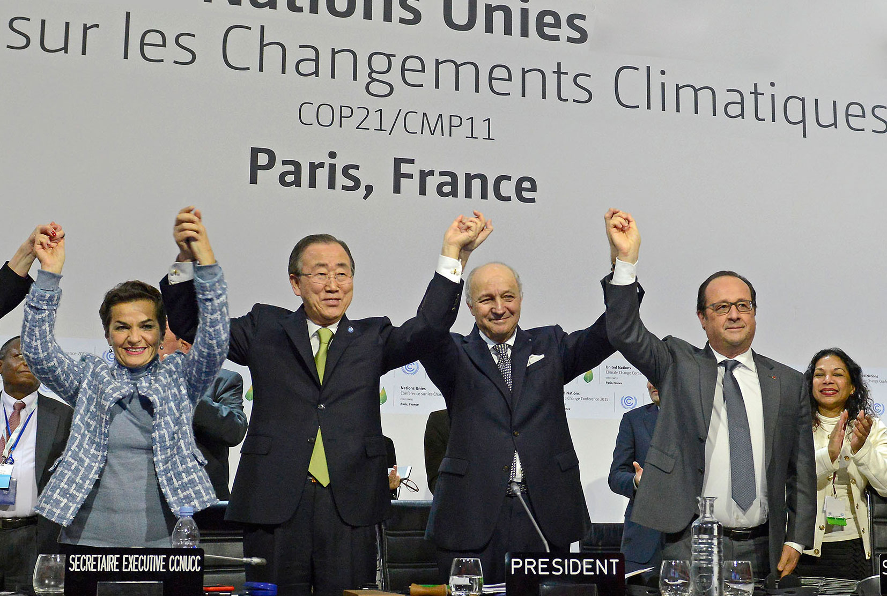
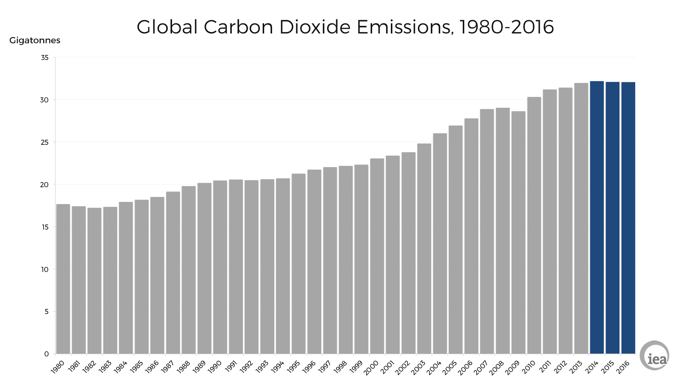
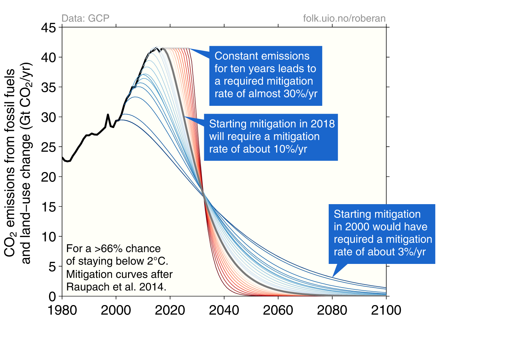
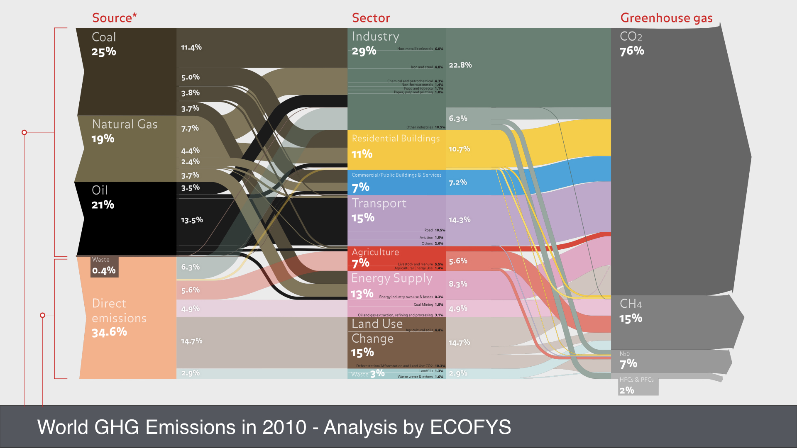
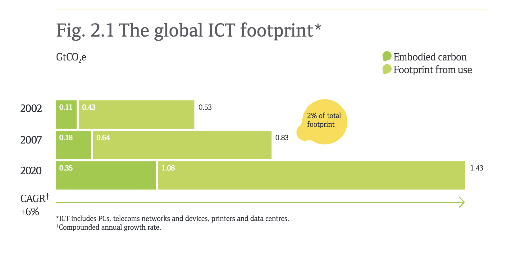

When someone mentions climate change to you, it might conjure up images of dirty great coal fired power stations, oil wells and gas guzzling cars, or deforestation in the Amazon.

It typically won't make you think of smiling tech CEOs walking around their datacentres, or slick websites as a source of emissions leading to climate change.

In fact, for the most part, we tend to pin our hopes on IT and technology as a way out of this climate change related dystopia. While technology obviously has a huge part to play in the future, it's not fit for purpose in it's current state.

I'm hoping that in this section, I can help you understand why, as people building the web, we might take the climate into account when we're making decisions about the digital products we build.

### Climate change is already causing the wrong kind of disruption to our world

If you've had someone speak to you about climate change, then it's likely that have come across the phrase _Global Warming_ before. It's a nice sounding phrase.

It can make you think of palm trees, champagne grapes in Britain, or warm holidays in sunny places. And while warmer world sounds nice, it turns out that the reality is less nice.

The reality is more extreme weather events, more drought, more destruction to vital ecosystems we rely on, and in general, problems of the kind that scientists describe as _existential threats_, and ones that can only really be solved by collective action.

### We've already agreed to reduce our emissions

The conversation we're having about climate is not a new one, and since the mid-nineties, your country's government has been assembling with governments from almost every other country[^almost-all-countries] on earth each year, to try to agree on what to do about this aforementioned existential threat to our civilisation.

[^almost-all-countries]: Well, 191 out of 192 countries that make up the United Nations

And finally, after 21 goes at getting it right, in 2015 in Paris – more or less everyone agreed that _yes we definitely want to limit climate change_, and we also want to aim for to less than 2 degrees of global warming in total.

_So to be clear - as a planet, we have agreed that this needs to happen_

This is important, as there are many decisions embedded in this decision to limit change to less than 2 degrees C.

### Two degrees of change limits the greenhouse gases we can leave in the atmosphere

If we want to stay within two degrees of climate change, we have a budget of about 2900 gigatonnes of CO2 we can emit by 2100, and each year, we need to reduce the amount of greenhouse gases we emit.

There are now a number of lovely looking, and sometimes daunting articles about our carbon budget. The New York times is seemingly creating [one every][NY-Times-You-fix-it] every [few months][NY-Times-how-far-from-goals], as is [the Guardian with their countdown clock][graun-countdown-clock].

[NY-Times-You-fix-it]:https://www.nytimes.com/interactive/2017/08/29/opinion/climate-change-carbon-budget.html
[NY-Times-how-far-from-goals]:https://www.nytimes.com/interactive/2017/11/06/climate/world-emissions-goals-far-off-course.html
[graun-countdown-clock]:https://www.theguardian.com/environment/datablog/2017/jan/19/carbon-countdown-clock-how-much-of-the-worlds-carbon-budget-have-we-spent

#### This is possible

According to the International Energy Agency, 2016 is the third year where global emissions didn’t increase, but the global economy still grew.

We’re seeing a decoupling of economic growth from emissions – and we can now point to this happening in America and China, the two biggest emitters as they move away from coal, while their economies continue to grow.

#### Winning too slowly will be the same as losing

Because it’s taken this long to reach this turning point, as a civilisation, we need to reduce our emissions much more aggressively than a few years ago if we want to stay within 2 degrees.

This graph from [Robbie Andrew at CICERO Center for International Climate Research][robbie-andrew-mitigation-curves] shows, the longer we leave it, the harder it gets to reduce emissions to a safe point.

- If we started in the year 2000, we would have reduce emissions by around 3% per year to stay in a safe zone.
- Starting this year in 2018, we now need to reduce emissions by 10 percent year on year.

In ten years time, we have to reduce emissions globally, by _30% a year_ to stand a good chance of staying within 2 degrees of warming.

[robbie-andrew-mitigation-curves]:(http://folk.uio.no/roberan/t/global_mitigation_curves.shtml)

So if we need to massively reduce our emissions, if we work in tech, how does our sector hold up?

### The environmental impact of IT

This Sankey diagram from 2010 shows a rough breakdown of global greenhouse gas emissions, by sector and gas.

The section on the left shows the key sources of emissions, the middle sections shows emissions by sector responsible for them.

The section on the right shows which gases are responsible for the Greenhouse effect - while carbon dioxide is the most well known, there are other, rarer but more potent gases too, like methane and various hydroflourocarbons (often used in refrigeration).

Agriculture is about 7%, and road transport is about 10%, like deforestation (filed euphemistically as “land use change” here), and energy generation is about 13%.

Aviation, only shows up as a between 1 and 2 percent of global emissions. And in this diagram, IT doesn't even show up – it's just lumped in with the other categories, and we need to look to specialist reports to see its impact.

#### Finding a figure for emissions

But we can find a figure - In 2008, the report [SMART 2020: Enabling the low carbon economy in the information age][smart-2020], put the emissions at IT around 830 million tonnes.

For perspective, if the IT was a country, its emissions would be larger than California, and most US states[^more-than-most-states], and most European countries[^more-than-most-eu-countries].

It's also growing faster year on year than aviation, based on [the aviation industry's own figures][iata-growth-figures], one of the previous fastest growing sources of emissions.

By 2020, the forecasts for IT are more than 1.4 billion tonnes.

[iata-growth-figures]:(http://www.iata.org/pressroom/pr/Pages/2016-10-18-02.aspx)

[smart-2020]:https://www.theclimategroup.org/sites/default/files/archive/files/Smart2020Report.pdf

[^more-than-most-states]: 830 million tonnes is larger than most of the countries on this [list of countries by GHG emissions](https://en.wikipedia.org/wiki/List_of_countries_by_greenhouse_gas_emissions)
[^more-than-most-eu-countries]: This is also larger than most US states [list of US states by CO2 emissions](https://en.wikipedia.org/wiki/List_of_U.S._states_by_carbon_dioxide_emissions)

So, it's not the largest source of emissions, but it _is_ growing extremely quickly, and pretty much every industry will need to change if we want to stay inside our planetary carbon budget.

So, what can we do?

And where does the environmental footprint occur in our work?

We'll cover this in the next part when we introduce a [Mental Model](/mental-model) for thinking about this.

[Jump to your mental model](/mental-model)

#### A very brief segway

If you woke up tomorrow and thought **I HAVE to do something important about climate change_**, you wouldn’t **start** with changing how you design your websites.

There are important discussions we need to have about our diets, (i.e. how much meat we eat, and how it's farmed), our homes (how we keep homes warm or cool), and how we choose where we live (i.e. how we plan our towns, the transport we rely on, and so on) if want a fighting chance at avoiding climate change.

There are many good books and guides covering the subjects above, and the focus of this guide more on the environmental sustainability _of_ IT and in particular digital products, not sustainability _through_ IT.

While we touch on the subject, if you're looking at a problem to turn your skills to, Bret Viktors essay, [What can a Technologist do about Climate Change](http://worrydream.com/ClimateChange/) is a revelation.
